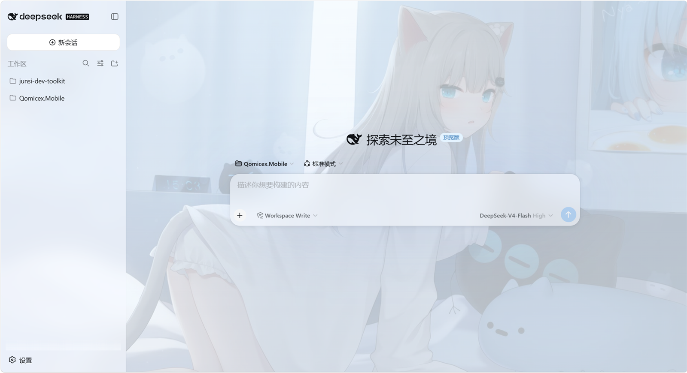

# dsh-nachoneko-theme

Nachoneko（甘城猫猫 / なちょこ）主题插件 for [DeepSeek Harness](https://github.com/deepseek-ai/deepseek-harness) Web GUI。

深色为主 · 全屏壁纸 + 半透明毛玻璃 · 主题色 `#A3D3FF`。



## 功能

- **主题色 `#A3D3FF`**：`--dsw-static-deepseek-*` 尺度以 `#A3D3FF` 为锚点重着色（品牌色、主按钮、业务状态、滚动条、气泡随尺度联动），`--dsw-static-blue-*` 为略深的伴生蓝（链接/次级强调）。
- **全屏壁纸**：`body` 铺壁纸（cover + fixed），叠加蓝调渐变遮罩保证可读性；深色/浅色各有一套遮罩。
- **毛玻璃**：侧边栏（blur 20px）、消息输入框（blur 24px）、markdown 代码块（blur 24px，底色略实 0.65 保证代码对比度）。
- **设置页装饰图**：`296.jpg` 缩略图贴在设置弹窗左下角（`z-index: -1` 垫在内容下层，不遮挡任何设置项）。
- **浅色/深色/跟随系统**：继续遵循 Harness 原有的外观设置。

## 安装

需要 `dsh` CLI 与 `pnpm`（`dsh plugin` 通过 pnpm 管理插件依赖）。

```bash
# 从 Git 安装（推荐）
dsh plugin --profile web add git+ssh://git@github.com/TheMyceliumOfAntan/dsh-nachoneko-theme.git

# 或从本地目录安装（开发/分享）
dsh plugin --profile web add C:\path\to\dsh-nachoneko-theme
```

然后**重启** `dsh web`（`dsh plugin` 只安装依赖并登记 bundle，loader 树在启动时重组）：

```bash
dsh web
# 浏览器打开 http://127.0.0.1:3080 （硬刷新 Ctrl+Shift+R）
```

> 注意：从 git 安装时 pnpm 可能提示需要允许 build 脚本——本插件没有任何原生依赖或 prepare 脚本，正常不会触发；若提示，按 pnpm 输出的提示在 `pnpm-workspace.yaml` 的 `allowBuilds` 里放行即可。

## 卸载

```bash
dsh plugin --profile web remove dsh-nachoneko-theme
# 重启 dsh web 后主题即消失
```

## 工作原理

- `dsh.bundle.patch` 声明本包是一个 profile bundle：安装后会被自动加入 `dsh.profile.bundles`，其 `cordis.patch.yml` 向 loader 树插入一行 `nachoneko-theme`。
- `dsh.client`（`platform: "web"`, `immediately: true`）让 client-modules 把本包的 `./client` bundle 纳入 `window.__DSH_BOOT__` 并在启动时立刻加载；client 侧的 cordis loader 会把每个 bundle 当作插件应用，因此 `client.js` 的 factory **必须返回合法的插件形状**（函数或带 `apply` 方法的对象），否则启动时报 `invalid plugin, expect function or object with an "apply" method, received undefined`。本主题的 factory 返回 `{ name, apply }`，CSS 注入在 `apply()` 里执行：向 `<head>` 注入一张 `<style data-plugin-css="dsh-nachoneko-theme/theme.css">`。
- 宿主侧 `index.js` 是 no-op——主题是纯浏览器端效果。
- `client.js` 完全自包含：壁纸与设置页角标以 base64 data URI 内联（client-modules 只服务 `/plugins/<id>/client.js`，不服务其他静态资源）。

## 自定义主题

资源文件在 `assets/`：

| 文件 | 说明 |
|------|------|
| `assets/nachoneko.css` | 主题样式源（token 重着色 + 壁纸遮罩 + 毛玻璃 + 角标） |
| `assets/nachoneko-bg.jpg` | 全屏壁纸（由 063.png 压缩为 1920px JPEG） |
| `assets/nachoneko-corner.jpg` | 设置页左下角装饰图（由 296.jpg 压缩为 480x280） |
| `assets/screenshot.png` | 主题实际效果截图（1600px） |

改完 `assets/nachoneko.css` 或换图后重新生成自包含 bundle：

```bash
node build.mjs
```

然后重启 `dsh web`（或直接刷新页面——`client.js` 以 `no-cache` 提供，浏览器会重新拉取）。

## 兼容性说明

- **token 重着色**（`--dsw-static-*` / `--dsw-alias-*`）与语义类 `.md-code-block` 相对稳定。
- 毛玻璃与壁纸透出依赖当前构建的 CSS Module 哈希类名：`.pI_x6G_frame`（应用根）、`.wSkVaW_root`（对话区根）、`.uV2eYG_card`（输入框）、`.VOzbGW_panel`（设置弹窗）。DSH 升级若改变这些哈希，对应的表面会退回不透明底色（主题仍可用，只是毛玻璃失效）——届时按新哈希更新 `assets/nachoneko.css` 即可。
- 两个已知陷阱（已在 CSS 中规避）：`backdrop-filter` 直接加在侧边栏/输入框/代码块上会把 `position: fixed` 后代（设置弹窗、浮层）关进包含块，因此毛玻璃一律用 `::before` 伪元素实现；对话区根 `.wSkVaW_root` 的不透明底色会完全挡住壁纸，必须改为半透明。

## 资源版权

- 代码（`client.js`、`index.js`、`build.mjs`、`cordis.patch.yml`）：MIT，见 [LICENSE](LICENSE)。
- `assets/` 下的插画图片来自网络，**不随 MIT 许可证授权**；分发或二次发布请自行确认素材权利。壁纸 `nachoneko-bg.jpg` 、角标 `nachoneko-corner.jpg` 著作权由原作者 `甘城なつき` 所有。

## License

MIT — 见 [LICENSE](LICENSE)。
